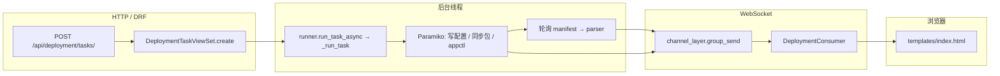

# 代码阅读指南

本文帮助你**按固定顺序**阅读本仓库源码：先建立全局图景，再沿「HTTP → 任务 → SSH → WebSocket → 前端」主链路深入。细节实现仍以 [`PROJECT_GUIDE.md`](PROJECT_GUIDE.md) 为准；[`README.md`](../README.md) 负责环境与远程 `appctl.sh` 命令说明。

---

## 1. 文档与代码的分工

| 资料 | 适合做什么 |
|------|------------|
| [`README.md`](../README.md) | 安装、迁移、启动、环境变量、远程命令与 `user_edit` 行为 |
| [`PROJECT_GUIDE.md`](PROJECT_GUIDE.md) | 架构、数据流、模块职责、WS 消息类型、manifest 合并规则 |
| **本文** | **从哪些文件开始读、按什么顺序读、主链路如何串起来** |

---

## 2. 建议阅读顺序（约 1～2 小时可走完主干）

按下面顺序打开文件，每步只抓「这一层负责什么」，不必一次读完所有实现。

1. **工程入口**  
   - `tpops_deployment/settings.py`：`INSTALLED_APPS`、数据库、`AUTH_USER_MODEL`、REST/JWT/Channels 相关配置。  
   - `tpops_deployment/urls.py`：HTTP API 前缀与 SPA 根路径 `"" → spa_index`。  
   - `tpops_deployment/asgi.py`：HTTP 与 WebSocket 如何挂到同一 ASGI 应用（注意文件内注释：Django 初始化顺序）。

2. **实时通道入口**  
   - `apps/logs/routing.py`：两条 WebSocket 路径与对应 Consumer。  
   - `apps/logs/consumers.py`：任务事件如何推给浏览器（可先扫类与 `deployment_event`）。  
   - `apps/logs/log_tail_consumer.py`：远程日志 tail 的入口与参数。

3. **部署任务（核心业务）**  
   - `apps/deployment/models.py`：`DeploymentTask` 字段与状态机。  
   - `apps/deployment/views.py`：`DeploymentTaskViewSet.create` 里 **`run_task_async`** 是异步执行起点。  
   - `apps/deployment/runner.py`：**必读**，线程内从写配置、传包、执行 `appctl` 到 manifest 轮询与 `_emit` 的全流程。  
   - `apps/deployment/access.py`：列表/详情与 WS 侧任务可见性过滤。  
   - `apps/deployment/serializers.py`：创建任务时的校验与落库字段。

4. **SSH 与主机**  
   - `apps/hosts/models.py`：`Host` 与部署根目录字段。  
   - `apps/hosts/crypto.py`：凭证加密思路。  
   - `apps/hosts/ssh_client.py`：远程命令、SFTP、读文件等（runner 会大量调用）。  
   - `apps/hosts/views.py`：`HostViewSet` 行为与权限边界。

5. **Manifest**  
   - `apps/manifest/parser.py`：YAML → 前端树/流水线结构、多文件合并。  
   - `apps/manifest/views.py`：`/api/manifest/parse/` 调试入口（若有）。

6. **安装包**  
   - `apps/packages/models.py`、`serializers.py`、`views.py`：Release/Artifact 与上传、远端 `pkgs/` 同步在 runner 中的衔接。

7. **认证**  
   - `apps/tpops_auth/models.py`：自定义用户。  
   - `apps/tpops_auth/views.py`、`urls.py`：注册、登录、刷新 Token、个人资料等。

8. **前端单页**  
   - `templates/index.html`：内联 Vue 3；可搜索 `WebSocket`、`/api/`、`manifest` 等关键字定位与后端的契约。  
   - `tpops_deployment/views.py`：`spa_index` 为何用原始响应返回 HTML（避免模板误解析 `{{ }}`）。

9. **计划与设计稿（扩展功能前）**  
   - `plan/README.md` 与具体 `plan/plan-*.md`。

---

## 3. 主链路一张图（读代码时对照）

从用户点击「创建任务」到界面收到日志，主干如下：

读代码时：**从 `views.py` 的 `create` 跳进 `runner.py`，再按需跳进 `ssh_client.py` / `parser.py` / `consumers.py`。**

---

## 4. HTTP 路由速查（读 `urls.py` 时对照）

全局路由在 `tpops_deployment/urls.py`，各应用再拆分：

| 前缀 | 定义文件 | 说明 |
|------|-----------|------|
| `/api/auth/` | `apps/tpops_auth/urls.py` | 注册、登录、JWT 刷新、资料、改密 |
| `/api/hosts/` | `apps/hosts/urls.py` | `HostViewSet`（DRF Router，`""` 注册） |
| `/api/deployment/` | `apps/deployment/urls.py` | `tasks` → `DeploymentTaskViewSet` |
| `/api/packages/` | `apps/packages/urls.py` | `releases`、`artifacts` |
| `/api/manifest/` | `apps/manifest/urls.py` | 如 `parse/` |
| `/` | `tpops_deployment/urls.py` | `spa_index` → SPA |
| `/admin/` | Django 内置 | 管理后台 |

---

## 5. WebSocket 速查

定义于 `apps/logs/routing.py`：

| 路径 | Consumer | 用途 |
|------|----------|------|
| `ws/deploy/<task_id>/` | `DeploymentConsumer` | 任务日志、manifest、状态、`done` |
| `ws/deploy/<task_id>/log/` | `DeployLogTailConsumer` | 按参数 tail 远程 `deploy/` 下日志 |

鉴权使用 **Query String 中的 JWT**（见 `PROJECT_GUIDE.md` 与 Consumer 实现），读代码时留意与 REST Header 方式的差异。

---

## 6. 按「问题」定位文件

| 你想搞清楚的事 | 优先打开 |
|----------------|----------|
| 任务创建后谁在跑、顺序是什么 | `apps/deployment/runner.py` |
| 为什么列表里看不到某条任务 | `apps/deployment/access.py` + 对应 ViewSet `get_queryset` |
| SSH 命令、路径、SFTP 细节 | `apps/hosts/ssh_client.py` |
| manifest 树、三节点合并 | `apps/manifest/parser.py` |
| WS 推了什么 JSON | `runner.py` 中 `_emit` + `apps/logs/consumers.py` |
| 前端如何拼 WS URL、如何渲染流水线 | `templates/index.html` |
| 环境变量、数据库、Channel 层 | `tpops_deployment/settings.py` |

---

## 7. 阅读时注意的几条「隐式约定」

1. **后台线程与数据库**：runner 在独立线程中跑，涉及 ORM 处需关注 `close_old_connections()` 等用法；SQLite 下并发写易锁库，行为在 `README.md` / `PROJECT_GUIDE.md` 中有说明。  
2. **安全**：主机密码/私钥加密落库，日志与异常信息中避免泄露解密后的明文。  
3. **前端兼容性**：SPA 曾避免部分新语法以兼容旧浏览器；改 `index.html` 时保持风格一致并自测控制台无报错。  
4. **新功能**：先在 `plan/` 写方案再改代码（仓库约定）。

---

## 8. 读完主干后可以深挖的目录

- `apps/deployment/user_edit.py`：`user_edit` 解析与校验。  
- `apps/deployment/remote_logs.py`：与远程日志路径、tail 相关的辅助逻辑。  
- `scripts/`：如远程启动 Daphne 的辅助脚本（运维向）。

若本文与 `PROJECT_GUIDE.md` 或代码不一致，**以代码为准**，并欢迎把差异补回文档。
