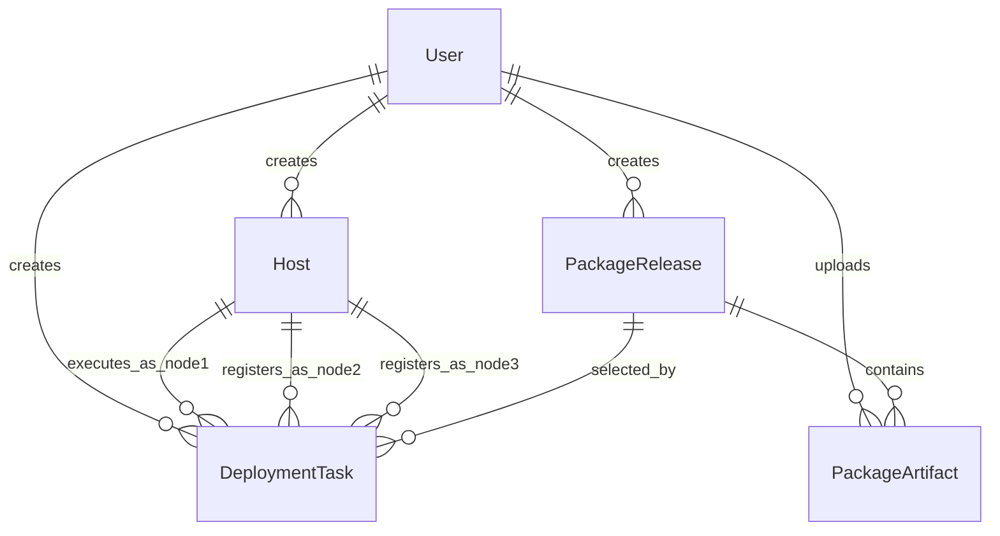
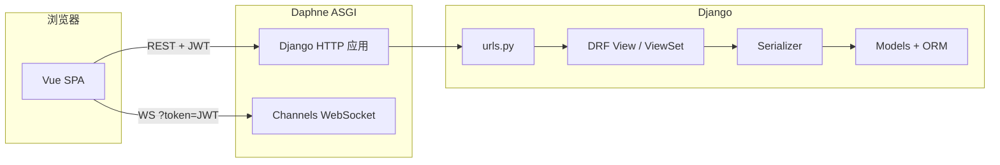
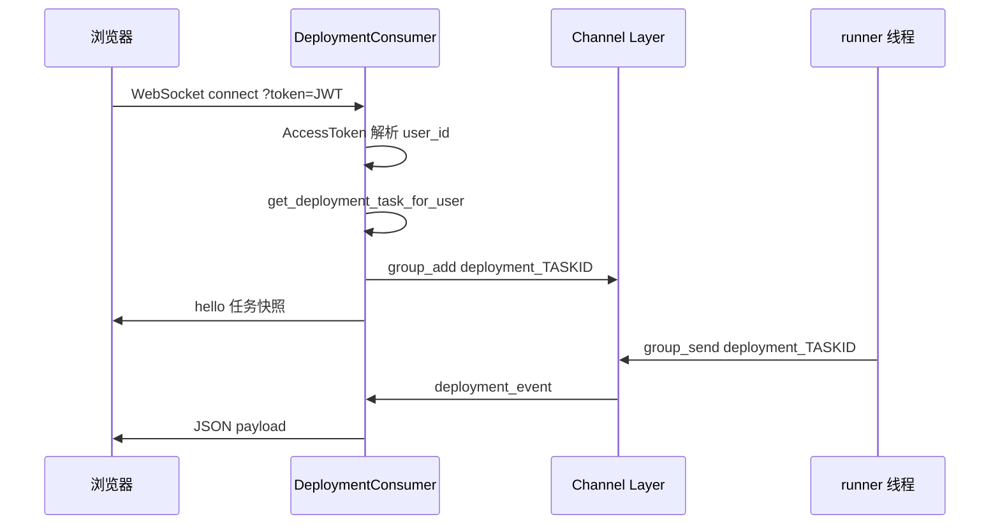
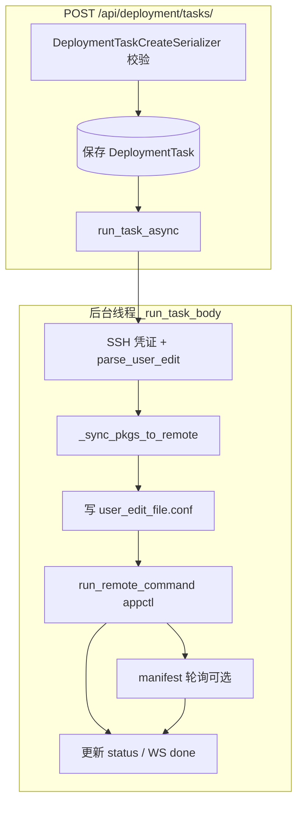

# TPOPS 白屏化部署平台 — 技术参考（数据库 · 路由 · 文件职责 · 流程图）

本文档面向需要**通读实现细节**的开发者，补充 `README.md`（上手）与 `docs/PROJECT_GUIDE.md`（导航）之外的**系统化说明**：数据模型、HTTP/WebSocket 全路径、各模块文件职责，以及关键业务流程的 Mermaid 图。

---

## 1. 技术栈与运行形态

| 层级 | 技术 | 说明 |
|------|------|------|
| Web 框架 | Django 3.2 LTS | 兼容 Python 3.7.9 |
| API | Django REST Framework + SimpleJWT | 无 Session；Bearer `Authorization` |
| 实时 | Django Channels + Daphne | 默认 `InMemoryChannelLayer` |
| 前端 | Vue 3 + Element Plus（CDN） | 单页逻辑在 `static/js/app/`，壳在 `templates/index.html` |
| 远程执行 | Paramiko | SSH 命令、SFTP、`remote_cat_file` 等 |

**入口**：HTTP/WS 均由 **ASGI**（`tpops_deployment/asgi.py`）处理；HTTP 落到 Django URLConf，WebSocket 走 `apps/logs/routing.py`。

---

## 2. 数据库建模

### 2.1 实体关系（概念）

### 2.2 表与字段摘要

#### `auth_user`（`apps.tpops_auth.models.User`）

扩展 Django `AbstractUser`：

| 字段 | 类型 | 说明 |
|------|------|------|
| `role` | CharField | `admin` / `operator` / `viewer` |
| `last_login_ip` | GenericIPAddressField | 登录时写入 |
| `created_at` / `updated_at` | DateTimeField | 审计 |

`settings.AUTH_USER_MODEL = "tpops_auth.User"`。

#### `hosts_host`（`apps.hosts.models.Host`）

| 字段 | 说明 |
|------|------|
| `name`, `hostname`, `port`, `username` | 展示名与 SSH 连接参数 |
| `auth_method` | `password` 或 `key` |
| `credential` | **Fernet 密文**（见 `apps/hosts/crypto.py`），不落明文 |
| `docker_service_root` | 远程 `appctl.sh` 所在目录，如 `/data/docker-service` |
| `created_by` | 属主；`null` 表示历史未绑定，非 staff 用户列表仍可见 |

#### `deployment_deploymenttask`（`apps.deployment.models.DeploymentTask`）

| 字段 | 说明 |
|------|------|
| `host` | **节点 1**：执行 SSH、写配置、跑 appctl |
| `host_node2` / `host_node3` | 三节点登记用；**不自动改 user_edit 里的 IP** |
| `deploy_mode` | `single` / `triple`（影响 manifest 轮询路径） |
| `action` | `precheck_install` / `precheck_upgrade` / `install` / `upgrade` / `uninstall_all` |
| `target` | precheck 类必填组件名；install/upgrade 等按现场可空 |
| `user_edit_content` | 将写入远程的 `[user_edit]` 全文（经校验） |
| `remote_user_edit_path` | 任务执行后回填实际写入路径 |
| `package_release` + `package_artifact_ids` | 可选介质；`skip_package_sync` 为真则不同步 |
| `package_cpu_type` / `package_os_type` | 保留字段，当前 MVP 校验以文件名为准 |
| `status`, `exit_code`, `error_message`, 时间戳 | 任务生命周期 |

#### `packages_packagerelease` / `packages_packageartifact`

- **Release**：版本分组（名称、说明、创建者）。
- **Artifact**：`FileField` 存本地 `media/packages/...`；`remote_basename` 为远端 `<部署根>/pkgs/` 下文件名；`unique_together (release, remote_basename)`。

### 2.3 物理库

默认 **`db.sqlite3`**（`settings.DATABASES`），`OPTIONS.timeout=30` 以缓解后台线程与 HTTP 并发锁表。生产建议 PostgreSQL/MySQL。

---

## 3. URL 总览与请求路径

### 3.1 根路由（`tpops_deployment/urls.py`）

| 前缀 | include / 视图 | 作用 |
|------|------------------|------|
| `admin/` | Django Admin | 后台管理 |
| `api/auth/` | `apps.tpops_auth.urls` | 注册、登录、JWT 刷新、个人信息 |
| `api/hosts/` | `apps.hosts.urls` | 主机 CRUD + 自定义 action |
| `api/deployment/` | `apps.deployment.urls` | 部署任务 |
| `api/packages/` | `apps.packages.urls` | 安装包版本与文件 |
| `api/manifest/` | `apps.manifest.urls` | 本地 manifest 调试解析 |
| `""` | `spa_index` | 返回 `templates/index.html`（Vue SPA） |
| `static/`、`media/` | `serve`（仅 `DEBUG`） | 静态与上传文件 |

### 3.2 HTTP 请求链路（概念）

---

## 4. 每个 URL 的实现细节

以下路径均相对于站点根（无尾部斜杠时以 DRF 路由为准）。**默认需登录**：`REST_FRAMEWORK.DEFAULT_PERMISSION_CLASSES = IsAuthenticated`，除显式 `AllowAny` 的视图。

### 4.1 认证 `api/auth/`（`apps/tpops_auth/urls.py` → `views.py`）

| 方法 | 路径 | 权限 | 实现要点 |
|------|------|------|----------|
| POST | `/api/auth/register/` | AllowAny | `RegisterSerializer` 建用户；返回用户摘要 |
| POST | `/api/auth/login/` | AllowAny | `LoginSerializer` 校验用户名密码；写 `last_login_ip`；返回 SimpleJWT `access` + `refresh` 与 `UserSerializer` |
| POST | `/api/auth/token/refresh/` | AllowAny（DRF JWT 默认） | `TokenRefreshView` 换发 access |
| GET | `/api/auth/profile/` | 已认证 | 当前用户 `UserSerializer` |
| PUT/PATCH | `/api/auth/update-profile/` | 已认证 | 部分更新用户信息 |
| POST | `/api/auth/change-password/` | 已认证 | 校验旧密码后 `set_password` |

**相关文件**：`apps/tpops_auth/serializers.py`（注册/登录/用户序列化）、`models.py`。

### 4.2 主机 `api/hosts/`（`DefaultRouter` → `HostViewSet`）

DRF Router 注册 `basename="host"`，资源名为 `host`，故列表为 **`/api/hosts/`**（尾部斜杠由 `APPEND_SLASH` 与客户端决定）。

| 方法 | 路径 | 作用 |
|------|------|------|
| GET | `/api/hosts/` | 列表；`get_queryset`：staff 看全部，否则 `created_by=本人` 或 `created_by__isnull=True` |
| POST | `/api/hosts/` | 创建；`HostSerializer` 将密码/私钥经 `encrypt_secret` 写入 `credential` |
| GET | `/api/hosts/<pk>/` | 详情 |
| PUT/PATCH | `/api/hosts/<pk>/` | 更新；若传入新密码/私钥则重加密 |
| DELETE | `/api/hosts/<pk>/` | 删除 |
| POST | `/api/hosts/<pk>/test_connection/` | `host_ssh_secret` → `test_ssh_connection`（Paramiko） |
| GET | `/api/hosts/<pk>/fetch_user_edit/` | `resolve_user_edit_conf_path` + `remote_cat_file`；`parse_user_edit_block` 校验；返回 `content`、`remote_path`；大小上限 512KB |

**相关文件**：`apps/hosts/views.py`、`serializers.py`、`ssh_client.py`、`crypto.py`。

### 4.3 部署任务 `api/deployment/tasks/`（`DeploymentTaskViewSet`）

| 方法 | 路径 | 作用 |
|------|------|------|
| GET | `/api/deployment/tasks/` | 列表；`filter_deployment_tasks_for_user`（见 `apps/deployment/access.py`） |
| POST | `/api/deployment/tasks/` | **创建**：`DeploymentTaskCreateSerializer` 校验（含 user_edit、包 ID 与 release 一致性等）→ 保存 → **`run_task_async(task.id)`** 启动后台线程 |
| GET | `/api/deployment/tasks/<pk>/` | 详情；`DeploymentTaskSerializer` |
| GET | `/api/deployment/tasks/<pk>/manifest_snapshot/` | **install/upgrade** 时 SSH 拉远程 manifest，解析为与 WebSocket 同结构的树；否则 400 |
| POST | `/api/deployment/tasks/<pk>/cancel/` | 运行中则标记 `cancelled`（MVP：不杀 SSH 子进程） |

**相关文件**：`apps/deployment/views.py`、`serializers.py`、`runner.py`、`access.py`、`user_edit.py`、`package_patterns.py`。

### 4.4 安装包 `api/packages/`（双 ViewSet）

**Release**（`/api/packages/releases/`）

| 方法 | 路径 | 作用 |
|------|------|------|
| GET/POST | `.../releases/` | 列表 / 创建版本 |
| GET/DELETE | `.../releases/<pk>/` | 详情 / 删除（级联 artifact） |

**Artifact**（`/api/packages/artifacts/`）

| 方法 | 路径 | 作用 |
|------|------|------|
| GET | `.../artifacts/?release=<id>` | 按版本筛列表 |
| POST | `.../artifacts/` | `MultiPartParser`；`PackageArtifactCreateSerializer`；保存后返回带绝对 URL 的 `PackageArtifactSerializer` |
| DELETE | `.../artifacts/<pk>/` | 删除记录并删物理文件（`model.delete`） |

**相关文件**：`apps/packages/views.py`、`serializers.py`、`models.py`。

### 4.5 Manifest 调试 `api/manifest/parse/`

| 方法 | 路径 | 作用 |
|------|------|------|
| POST | `/api/manifest/parse/` | Body 中 `content` 或上传 `file` → `manifest_to_tree`（`apps/manifest/parser.py`）返回解析树 JSON |

### 4.6 SPA 与静态资源

| 方法 | 路径 | 作用 |
|------|------|------|
| GET | `/` | `spa_index`：读 `templates/index.html`，对 `static/js/app/*.js` 与 `app.css` 追加 `?v=mtime` 防缓存 |
| GET | `/static/...` | DEBUG 下 `django.views.static.serve` |
| GET | `/media/...` | DEBUG 下媒体文件（安装包上传目录） |

### 4.7 Admin

| 方法 | 路径 | 作用 |
|------|------|------|
| * | `/admin/` | Django 自带后台（若注册了 ModelAdmin） |

---

## 5. WebSocket 路径与实现

定义于 `apps/logs/routing.py`，挂载在 ASGI 的 `URLRouter` 内。

| 路径 | Consumer | 说明 |
|------|----------|------|
| `ws/deploy/<task_id>/` | `DeploymentConsumer` | 查询串 **`token=<JWT access>`**（浏览器无法给 WS 带 Header）。校验用户对该任务的权限后加入 `group_send` 组 `deployment_<task_id>`；首包 `type: hello` 含任务状态 |
| `ws/deploy/<task_id>/log/` | `DeployLogTailConsumer` | 同上 token；按 `kind` 或 `rel` 参数 tail 远程 `deploy/*.log`（实现见 `log_tail_consumer.py`、`remote_logs.py`） |

Runner 侧通过 `channels.layers.get_channel_layer` + `async_to_sync(group_send)` 推送 `log`、`phase`、`manifest`、`status`、`done` 等 JSON。

---

## 6. 部署任务执行路径（核心）

创建任务后，`runner.run_task_async` → `_run_task`（线程）→ `_run_task_body`：

1. 打开本地任务日志文件（`apps/deployment/task_file_log.py`，可选目录 `DEPLOYMENT_TASK_LOG_DIR`）。
2. 解密 SSH；解析 `user_edit`。
3. **若未跳过包同步**：`_sync_pkgs_to_remote`（含 TPOPS 时在 `/data` 准备再汇入 `<部署根>/pkgs/`，**先于**写 user_edit，避免解压覆盖配置）。
4. `resolve_user_edit_conf_path` → `write_remote_file_utf8`。
5. `_build_appctl_command` → `run_remote_command` 流式输出；并行 manifest 轮询（install/upgrade）。
6. 更新任务状态、`done` 消息、`close_task_log`。

---

## 7. 仓库目录与关键文件职责

### 7.1 Django 项目 `tpops_deployment/`

| 文件 | 职责 |
|------|------|
| `settings.py` | DB、Installed apps、DRF/JWT、Channels、`MEDIA`、`STATIC`、CORS |
| `urls.py` | 根 URL 分发 |
| `asgi.py` | HTTP + WebSocket 合一入口 |
| `wsgi.py` | 传统 WSGI（可选） |
| `views.py` | SPA 首页 `spa_index` |

### 7.2 应用 `apps/tpops_auth/`

| 文件 | 职责 |
|------|------|
| `models.py` | 自定义 `User` |
| `views.py` | 注册、登录、profile、改密 |
| `urls.py` | auth 路由 |
| `serializers.py` | 登录注册与用户序列化 |

### 7.3 `apps/hosts/`

| 文件 | 职责 |
|------|------|
| `models.py` | `Host` |
| `views.py` | `HostViewSet`、test_connection、fetch_user_edit |
| `serializers.py` | `HostSerializer`、`host_ssh_secret` |
| `ssh_client.py` | SSH/SFTP/远程命令/读文件/写 UTF-8 |
| `crypto.py` | Fernet 加解密凭证 |

### 7.4 `apps/deployment/`

| 文件 | 职责 |
|------|------|
| `models.py` | `DeploymentTask` |
| `views.py` | `DeploymentTaskViewSet`、manifest_snapshot、cancel |
| `serializers.py` | 创建/列表序列化、包名校验 |
| `runner.py` | 同步包、写配置、appctl、manifest 轮询、WS 批量日志 |
| `access.py` | 任务列表/详情权限过滤 |
| `user_edit.py` | `[user_edit]` 块解析 |
| `package_patterns.py` | 安装包文件名角色分类 |
| `task_file_log.py` | 本地 `task_<id>.log` 追加 |

### 7.5 `apps/packages/`

| 文件 | 职责 |
|------|------|
| `models.py` | `PackageRelease`、`PackageArtifact` |
| `views.py` | 两个 ViewSet |
| `serializers.py` | 创建 artifact 时处理 multipart |

### 7.6 `apps/manifest/`

| 文件 | 职责 |
|------|------|
| `parser.py` | YAML → 流水线树、层级状态汇总 |
| `views.py` | `parse_manifest` API |

### 7.7 `apps/logs/`

| 文件 | 职责 |
|------|------|
| `routing.py` | WebSocket URL 列表 |
| `consumers.py` | `DeploymentConsumer` |
| `log_tail_consumer.py` | 远程日志 tail |

### 7.8 前端 `static/js/app/`、`static/css/app.css`

| 文件 | 职责 |
|------|------|
| `main.js` | 入口、挂载、axios 基址与 JWT 拦截 |
| `template.js` | 大块 HTML 模板字符串 |
| `deploy.js` | 部署向导、任务列表、WebSocket、manifest 展示 |
| `packages.js` | 安装包上传与列表 |
| 其他模块 | 主机、登录、路由 hash 等（按 `main.js` import） |

### 7.9 模板与计划

| 路径 | 职责 |
|------|------|
| `templates/index.html` | 单页壳、CDN 引用 |
| `plan/*.md` | 功能设计与验收说明 |

---

## 8. 安全与运维提示

- **JWT**：API 使用 `Authorization: Bearer <access>`；WebSocket 使用 query `token`。
- **密钥**：`DJANGO_SECRET_KEY`、主机凭证勿入库版本控制。
- **Channels**：默认内存层，多进程部署需换 Redis 等，否则 WS 组播不可跨进程。
- **任务日志**：默认 `logs/deployment_tasks/task_<id>.log`（见 `task_file_log.py`）。

---

## 9. 文档索引

| 文档 | 内容侧重 |
|------|----------|
| `README.md` | 环境变量、启动命令、向导步骤摘要 |
| `docs/PROJECT_GUIDE.md` | 模块导航与 runner 阅读顺序 |
| **本文档** | 数据模型、全 URL/WS、文件地图、Mermaid 总览 |
| `plan/plan-*.md` | 各专题设计与验收 |

---

*文档版本与仓库代码同步维护；若路由或模型有变更，请同步更新本节。*
