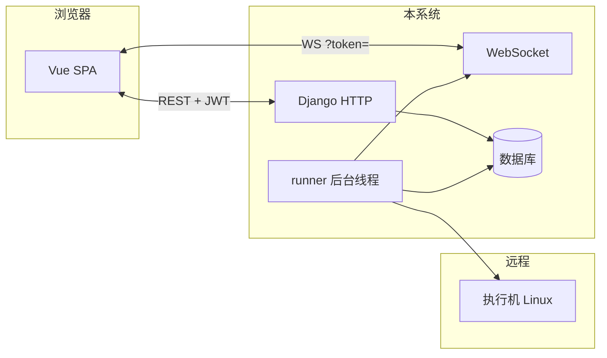

# TPOPS 白屏化部署平台 — 技术参考索引

本页是**总入口**：按主题拆成的**分章文档**在 **`docs/chapters/`**，面向从「完全小白」到开发者的不同深度；每章尽量自成一体，可顺序阅读或按需跳转。

---

## 分章文档（推荐主阅读路径）

| 章 | 文档 | 内容 |
|:--:|------|------|
| 目录 | [**`chapters/README.md`**](chapters/README.md) | 全部章节索引表 |
| 0 | [**写给完全小白：整体在干什么**](chapters/00-overview-for-beginners.md) | 浏览器、本系统、数据库、SSH 四者关系 |
| 1 | [**数据库与数据模型**](chapters/01-database-and-models.md) | 各表字段、ER 图、小白说明 |
| 2 | [**HTTP 路由与一次请求怎么走**](chapters/02-http-routing-and-requests.md) | `urls.py`、View、Serializer、时序图 |
| 3 | [**认证模块 `tpops_auth`**](chapters/03-auth-module.md) | 注册、登录、JWT、各 URL |
| 4 | [**主机模块 `hosts`**](chapters/04-hosts-module.md) | SSH 主机、加密、测连、`fetch_user_edit` |
| 5 | [**部署模块 `deployment`**](chapters/05-deployment-module.md) | 任务、runner、传包、appctl、manifest |
| 6 | [**安装包模块 `packages`**](chapters/06-packages-module.md) | Release、Artifact、上传、与任务关联 |
| 7 | [**清单模块 `manifest`**](chapters/07-manifest-module.md) | YAML 解析、调试 API |
| 8 | [**日志与 WebSocket `logs`**](chapters/08-logs-websockets-module.md) | 实时推送、token 在 URL、消息类型 |
| 9 | [**前端单页 SPA**](chapters/09-frontend-spa.md) | `index.html`、`static/js/app`、`?v=` 缓存 |
| 10 | [**工程壳与目录地图**](chapters/10-project-layout-and-files.md) | `tpops_deployment/`、`apps/` 总表与总流程图 |
| 11 | [**安全与运维注意**](chapters/11-security-and-operations.md) | 密钥、Channels、DB、DEBUG |

---

## 一页速览（技术栈 + 总关系）

| 层级 | 技术 |
|------|------|
| Web | Django 3.2、DRF、SimpleJWT |
| 实时 | Django Channels + Daphne（默认内存 Channel Layer） |
| 前端 | Vue 3 + Element Plus（CDN），逻辑在 `static/js/app/` |
| 远程 | Paramiko（SSH / SFTP / 读文件） |

---

## 与其它文档的关系

| 文档 | 定位 |
|------|------|
| [`README.md`](../README.md) | 环境变量、安装、启动命令 |
| [`PROJECT_GUIDE.md`](PROJECT_GUIDE.md) | 代码阅读顺序与数据流导航 |
| **`docs/chapters/`**（本索引指向） | **按模块、偏小白**的详细说明 + 各章内 Mermaid |
| [`plan/plan-*.md`](../plan/) | 单个功能的设计与验收 |

---

*若新增业务模块，请同步增加 `docs/chapters/` 章节并在上表登记。*
