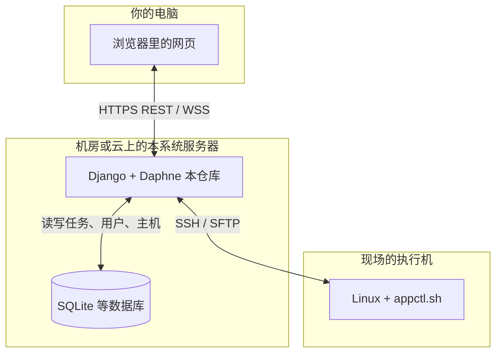

# 第 0 章：写给完全小白 —— 整体在干什么？

如果你已经熟悉 Web 开发，可以跳过本章，从 [第 1 章](01-database-and-models.md) 开始。

---

## 1. 这个平台解决什么问题？

现场有一台（或多台登记）**Linux 服务器**，上面要跑 TPOPS / GaussDB 的 **docker-service**，靠远程目录里的 **`appctl.sh`** 做安装、升级、卸载等。

本系统做三件事：

1. **在网页上登记**这些服务器怎么连（SSH 地址、用户、密码或密钥、以及 `appctl.sh` 在哪个目录）。
2. **在网页上填配置**（`user_edit_file.conf` 里的内容），点按钮后由**本服务器后台**去 SSH 连上执行机，把配置写过去，再执行 `appctl.sh …`。
3. **把执行过程的输出、以及安装进度文件（manifest）**实时推回浏览器，方便你看进度、排错。

你可以把「本系统」想成：**一个带网页的控制台**，代替你在终端里反复 SSH、敲命令（但底层仍然是 SSH）。

---

## 2. 四个角色：浏览器、本系统、数据库、远程 Linux

- **浏览器**：只负责展示界面、发 HTTP 请求、连 WebSocket。**不直接**连你的现场服务器。
- **本系统（Django）**：唯一会拿 SSH 密码去连现场机的一方；任务状态、主机列表存在**数据库**里。
- **数据库**：存用户、主机、部署任务、上传的安装包元数据等。
- **远程 Linux**：真正跑 `appctl.sh` 的机器；本系统用 **Paramiko** 连上去执行命令、传文件。

---

## 3. 两个常见词：API 和 JWT

- **API**：浏览器向本系统发的「结构化请求」，例如「列出所有主机」「创建一条部署任务」。本系统返回 **JSON**（一种文本数据格式）。
- **JWT（JSON Web Token）**：登录成功后发给你的一串**令牌**。之后访问大部分 API 时，浏览器在请求头里带上：`Authorization: Bearer <令牌>`，本系统就知道你是哪个用户。**不要用浏览器普通 Cookie 会话**，所以关页面再开，只要令牌没过期，仍可访问。

WebSocket 不能方便地带头，所以任务实时连接用 **URL 参数**：`?token=<同一串 access 令牌>`。

---

## 4. 一次「下发部署」在逻辑上发生什么？

用人话概括（细节见 [第 5 章](05-deployment-module.md)）：

1. 你在网页填好：选哪台机、做什么操作、配置内容、要不要传安装包。
2. 浏览器 **POST** 到本系统 → 本系统在数据库里**新建一条任务记录**（状态「待执行」），并**立刻启动后台线程**。
3. 后台线程：SSH 连上 → 如需则先传包解压 → 写 `user_edit_file.conf` → 执行 `appctl.sh` → 把输出和 manifest 通过 **WebSocket** 推给浏览器。
4. 任务结束 → 数据库里更新「成功/失败」、退出码等。

---

## 5. 本目录各章怎么读？

- **想先懂数据**：第 1 章。  
- **想先懂 URL**：第 2 章 + 第 3～8 章按模块。  
- **想改界面**：第 9 章。  
- **想全局扫文件**：第 10 章。

下一章：[数据库与数据模型](01-database-and-models.md)
