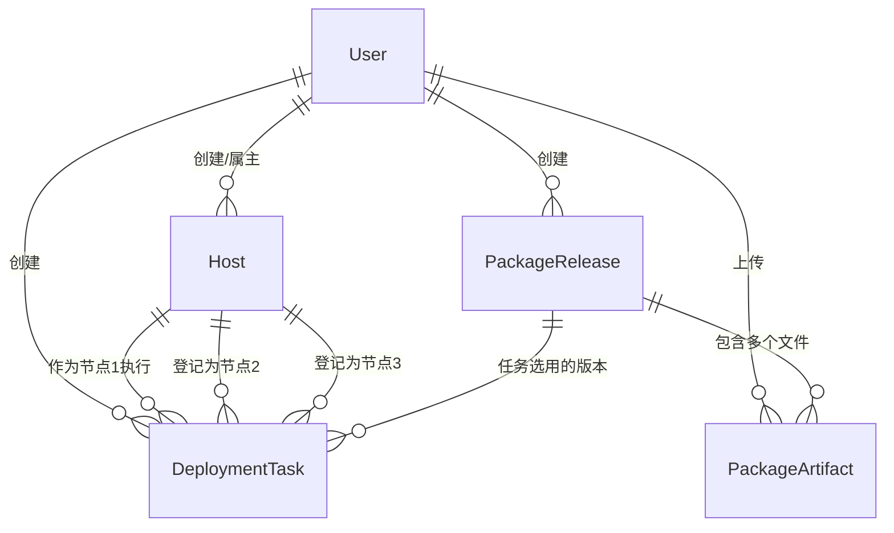

# 第 1 章：数据库与数据模型

本章说明：**数据存在哪里、有哪些「表」、每张表存什么、表之间怎么关联**。不要求你会写 SQL，能看懂「实体」即可。

---

## 1. 数据库在哪？

默认配置在 `tpops_deployment/settings.py` 里：开发常用 **SQLite**，对应项目根目录下的 **`db.sqlite3`** 文件。

- **优点**：零安装，适合演示。  
- **缺点**：并发写多时可能锁表；生产环境建议换成 **PostgreSQL / MySQL**（仍是 Django ORM，模型代码不用改）。

---

## 2. 用一张「关系图」理解所有表

下面不是真实表名，而是**概念**；后面小节会对应到 Django 模型。

---

## 3. 用户表 `User`（`apps/tpops_auth.models`）

Django 自带「用户」概念；本项目**扩展**了用户模型，表名一般为 **`auth_user`**（由 `db_table` 指定）。

| 概念 | 说明 |
|------|------|
| 用户名 / 密码 | 登录用；密码是**哈希**存储，不是明文。 |
| `role` | 角色：`admin`（管理员）、`operator`、`viewer` 等，用于以后做权限扩展。 |
| `last_login_ip` | 上次登录 IP，便于审计。 |

**小白提示**：你不需要直接改数据库里的用户；用「注册接口」或 `createsuperuser` 命令创建即可。

---

## 4. 主机表 `Host`（`apps.hosts`）

每一行代表你纳管的一台 **SSH 目标机**。

| 字段 | 通俗理解 |
|------|----------|
| `name` | 给人看的昵称，例如「生产节点1」。 |
| `hostname` / `port` / `username` | 怎么 SSH 上去。 |
| `auth_method` | 用密码还是私钥登录。 |
| `credential` | **加密后的**密码或私钥；**永远不要**把解密后的内容写进日志或返回给前端列表（列表里只有 `has_credential` 这种布尔提示）。 |
| `docker_service_root` | 远程 **`appctl.sh` 所在目录**，例如 `/data/docker-service`；后面所有「相对部署根」的路径都基于它。 |
| `created_by` | 谁创建的；`null` 可表示历史数据未绑定属主。 |

---

## 5. 部署任务表 `DeploymentTask`（`apps.deployment`）

每一行代表你发起的一次 **「让后台去 SSH 执行一整套动作」** 的记录。

| 字段 | 通俗理解 |
|------|----------|
| `host` | **节点 1**：真正 SSH 上去执行的那台机。 |
| `host_node2` / `host_node3` | 仅「三节点模式」时在界面上登记的另外两台；**系统不会自动改你配置里的 IP**。 |
| `deploy_mode` | `single` 或 `triple`，影响读哪些 manifest 文件。 |
| `action` | 要跑哪种操作：前置检查、安装、升级、卸载等（对应不同 `appctl.sh` 子命令）。 |
| `target` | 某些操作必填的组件名（如 precheck 时要填 `gaussdb`）。 |
| `user_edit_content` | 你要写到远程的 **整段配置文本**（含 `[user_edit]`）；保存前会校验格式。 |
| `remote_user_edit_path` | 任务跑完后，**实际写到了远程哪个路径**（系统会探测或创建）。 |
| `package_release` + `package_artifact_ids` | 选用哪个「安装包版本」、以及勾选哪些文件 ID；可与「跳过同步」配合。 |
| `skip_package_sync` | 为真时**不传包**，认为现场已有包。 |
| `status` / `exit_code` / `error_message` | 任务进行到哪、成功失败、错误摘要。 |
| 时间字段 | 创建、开始执行、结束时间。 |

---

## 6. 安装包相关表（`apps.packages`）

### `PackageRelease`（版本）

例如「TPOPS-2026Q1」这样一个**分组**，下面可以挂多个文件。

### `PackageArtifact`（具体文件）

| 字段 | 通俗理解 |
|------|----------|
| `file` | 文件在**本系统磁盘**上的路径（一般落在 `media/packages/年/月/`）。 |
| `original_name` | 用户上传时的原始文件名。 |
| `remote_basename` | 传到现场机 **`部署根/pkgs/`** 下时用的文件名（会做安全字符处理）。 |
| `release` | 属于哪个版本分组。 |

**唯一约束**：同一版本下 `remote_basename` 不能重复（避免覆盖混乱）。

---

## 7. 小结

- **用户**：谁能登录、谁创建的资源。  
- **主机**：连哪台机、部署根在哪、凭证加密存。  
- **任务**：一次完整下发与执行的生命周期。  
- **安装包**：本机存文件 + 数据库记元数据，供任务同步到远端 `pkgs/`。

上一章：[写给完全小白](00-overview-for-beginners.md)  
下一章：[HTTP 路由与一次请求怎么走](02-http-routing-and-requests.md)
