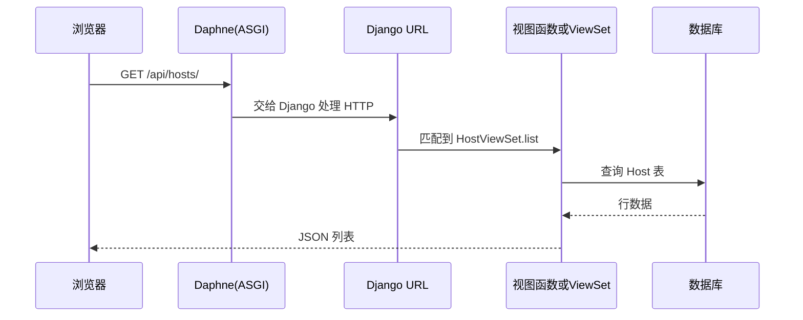

# 第 2 章：HTTP 路由与一次请求怎么走？

本章用**最少术语**说明：你在浏览器里访问的 **URL**，是如何一步步进到 **Python 函数**里的。

---

## 1. 两个入口：浏览器只跟「本系统」说话

- **普通页面与 API**：走 **HTTP**（`https://你的域名/...`）。  
- **任务实时输出**：走 **WebSocket**（`wss://你的域名/ws/...`），第 8 章细讲。

本章只讲 **HTTP**。

---

## 2. 总路由表：所有前缀从哪来？

文件：`tpops_deployment/urls.py`。

可以理解为一张**总目录**：

| 路径前缀 | 交给谁处理 |
|----------|------------|
| `admin/` | Django 自带后台 |
| `api/auth/` | 认证应用 `tpops_auth` 的 `urls.py` |
| `api/hosts/` | 主机应用 `hosts` |
| `api/deployment/` | 部署应用 `deployment` |
| `api/packages/` | 安装包应用 `packages` |
| `api/manifest/` | 清单应用 `manifest` |
| `""`（网站根 `/`） | 返回单页 `spa_index`，即 Vue 网页壳 |

开发模式下还会挂上 **`/static/`**、**`/media/`**，用来在浏览器里直接打开 JS、CSS 和上传的安装包文件。

---

## 3. 一次 GET 请求的简单路径

**小白提示**：  
- **URL 匹配**就像「按门牌找房间」。  
- **视图**就是「房间里办事的人」。  
- **JSON** 是一种纯文本数据，方便网页里的 JavaScript 使用。

---

## 4. POST 创建资源时多两步：校验与保存

以「创建部署任务」为例（详见 [第 5 章](05-deployment-module.md)）：

1. 浏览器 **POST** JSON 到 `/api/deployment/tasks/`。  
2. **序列化器（Serializer）**检查字段是否合法、外键是否存在、业务规则是否满足。  
3. 合法则 **ORM `save()`** 写入 `DeploymentTask` 表。  
4. 视图再调用 **`run_task_async`** 启动后台线程（这一步不是数据库，是 Python 线程）。

---

## 5. 认证怎么挂在每个请求上？

全局配置在 `settings.py` 的 `REST_FRAMEWORK`：

- 默认：**必须登录**（`IsAuthenticated`）。  
- 登录方式：请求头 **`Authorization: Bearer <access_token>`**。

少数接口（注册、登录、刷新令牌）会单独标成 **允许匿名**（`AllowAny`），否则没人能登录。

---

## 6. 本章小结

- **`urls.py`**：把 URL 前缀分给各个 app。  
- **View / ViewSet**：真正处理请求的 Python 类或函数。  
- **Serializer**：校验输入、格式化输出。  
- **Model + ORM**：读写数据库表。

接下来按模块拆开：从 [认证模块](03-auth-module.md) 开始。

上一章：[数据库与数据模型](01-database-and-models.md)  
下一章：[认证模块 tpops_auth](03-auth-module.md)
