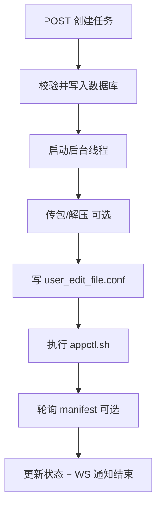

# 第 5 章：部署模块（`apps/deployment`）

本章是**核心**：**部署任务是什么、创建后后台做什么、传包与写配置顺序、manifest 是什么**。目录：`apps/deployment/`。

---

## 1. 一条「部署任务」生命周期（人话版）

1. 你在网页填：操作类型、目标组件（部分操作需要）、`user_edit` 全文、是否传包、选哪台 **节点 1**。  
2. 点「下发」→ 浏览器 **POST** `/api/deployment/tasks/`。  
3. 系统校验通过 → **数据库里多一行任务**（状态 `pending`）→ **立刻启动后台线程**（不阻塞 HTTP 响应太久）。  
4. 后台线程：  
   - 解密 SSH；  
   - 校验 `user_edit`；  
   - **如需**：先传安装包/解压（顺序很重要，见下）；  
   - 再写 **`user_edit_file.conf`** 到远程；  
   - 再 **`cd 部署根 && sh appctl.sh ...`**；  
   - 同时（安装/升级时）**轮询读取**远程 `manifest.yaml` 并推给前端。  
5. 结束 → 更新状态、`exit_code`、通过 WebSocket 发 `done`。

---

## 2. 为什么要「先传包、再写配置」？

TPOPS 主包解压时可能带出 **`docker-service` 目录**，里面若带有默认配置文件，**后解压可能覆盖**你刚写的内容。  
因此 runner 里约定：**介质准备（传包、解压）完成后再写入 `user_edit`**。

---

## 3. `action` 与远程命令的对应（概念）

具体拼接在 **`runner._build_appctl_command`**：在远程 **`docker_service_root`** 下执行 `sh appctl.sh <子命令>`；部分操作会管道 `yes` 自动回答交互提示。

| `action`（存库值） | 通俗含义 |
|--------------------|----------|
| `precheck_install` / `precheck_upgrade` | 前置检查，通常必须填 `target` 组件名 |
| `install` / `upgrade` | 安装 / 升级 |
| `uninstall_all` | 卸载全部 |

---

## 4. 安装包同步（两种模式，人话）

- **勾了 TPOPS 主包 + install/upgrade + 未整包跳过**：走 **「先 `/data` 再汇入 `部署根/pkgs`」** 的专用流程（解压 `TPOPS-GaussDB-Server` 目录、再找包内 `docker-service` 压缩包等）。细节见 `plan/plan-tpops-gaussdb-package-selection.md`。  
- **其它情况**：把选中的文件 **直接 SFTP** 到 **`<部署根>/pkgs/`**（扁平文件名）。

包名分类规则在 **`package_patterns.py`**；创建任务时的校验在 **`serializers.py`**。

---

## 5. Manifest 是什么？

现场脚本执行过程中会写/更新 **`manifest.yaml`**（在部署根下的 `config/gaussdb/` 等路径，由代码统一解析）。  
里面描述**安装流水线层级、子步骤状态**。本系统把它 **YAML → 树状 JSON**，通过 WebSocket **`type: manifest`** 推给前端画进度条。

解析逻辑在 **`apps/manifest/parser.py`**；部署里轮询逻辑在 **`runner.py`**。

---

## 6. 相关 API（`DeploymentTaskViewSet`）

| 方法 | 路径 | 说明 |
|------|------|------|
| GET | `/api/deployment/tasks/` | 任务列表（按用户过滤，见 `access.py`） |
| POST | `/api/deployment/tasks/` | 创建并 **异步执行** |
| GET | `/api/deployment/tasks/<id>/` | 详情 |
| GET | `/api/deployment/tasks/<id>/manifest_snapshot/` | 任务结束后，再拉一次 manifest 树（仅 install/upgrade 有意义） |
| POST | `/api/deployment/tasks/<id>/cancel/` | MVP：标记取消（不保证立刻杀 SSH） |

---

## 7. 关键文件速查

| 文件 | 作用 |
|------|------|
| `models.py` | 任务表结构 |
| `views.py` | 创建任务、manifest 快照、取消 |
| `serializers.py` | 入参校验、出参展示字段 |
| `runner.py` | **真正干活的流水线** |
| `access.py` | 谁能看到哪些任务 |
| `user_edit.py` | 配置块解析 |
| `package_patterns.py` | 安装包文件名分类 |
| `task_file_log.py` | 本地文件日志（与 WS 并行） |

---

上一章：[主机模块](04-hosts-module.md)  
下一章：[安装包模块 packages](06-packages-module.md)
