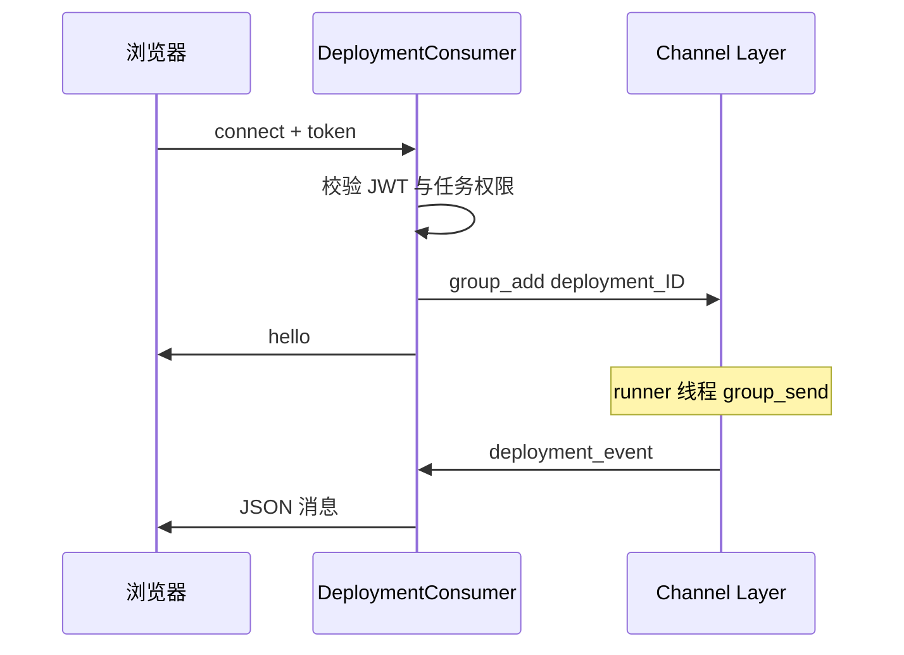

# 第 8 章：日志与 WebSocket 模块（`apps/logs`）

本章说明：**浏览器怎么实时看到任务输出、消息长什么样、为什么 token 在 URL 里**。目录：`apps/logs/`。

---

## 1. 为什么不用「一直 GET 轮询」？

任务可能跑很久，输出很多。若浏览器每隔一秒 **GET 一次日志接口**，服务器压力大、也不够实时。

**WebSocket**：浏览器和服务器之间开一条**长连接**，服务器**随时**可以往浏览器推数据，适合日志流与 manifest 更新。

---

## 2. 两条 WebSocket 路径（`apps/logs/routing.py`）

| 路径 | 用途 |
|------|------|
| `ws/deploy/<任务id>/` | 任务主通道：`log`、`phase`、`manifest`、`status`、`done` 等 |
| `ws/deploy/<任务id>/log/` | 按参数 tail 远程 **`deploy` 目录下某个 .log 文件**（如 install.log） |

**认证**：查询参数 **`?token=<JWT access>`**。  
原因：浏览器原生 WebSocket API **不方便**设置 `Authorization` 头，所以复用同一串 access token。

---

## 3. 连接建立时发生什么？（`DeploymentConsumer`）

1. 解析 URL 里的 `task_id` 与 `token`。  
2. 用 SimpleJWT 验证 token → 得到用户。  
3. 查库确认该用户**有权访问这个任务**（`get_deployment_task_for_user`）。  
4. 加入 Channels **组** `deployment_<任务id>`。  
5. 立刻发一条 **`type: hello`**，带上当前任务状态、action、错误摘要等，前端可用来恢复界面。

---

## 4. 常见消息类型（小白版）

| `type` | 含义 |
|--------|------|
| `hello` | 刚连上，告诉你任务当前状态 |
| `log` | 一段文本输出（可能合并多条再发，减少卡顿） |
| `phase` | 当前阶段说明（例如「正在上传某某包」） |
| `manifest` | 一整棵流水线解析结果 |
| `status` | `pending` / `running` / `success` / `failed` 等 |
| `done` | 任务结束，带退出码等 |

---

## 5. Channel Layer 注意

默认 **`InMemoryChannelLayer`**：只适合**单进程**开发。  
若你开多个 Daphne worker，WebSocket 与后台线程可能不在同一进程，**收不到消息**；生产需换 **Redis** 等后端（见 [第 11 章](11-security-and-operations.md)）。

---

上一章：[清单模块](07-manifest-module.md)  
下一章：[前端单页 SPA](09-frontend-spa.md)
