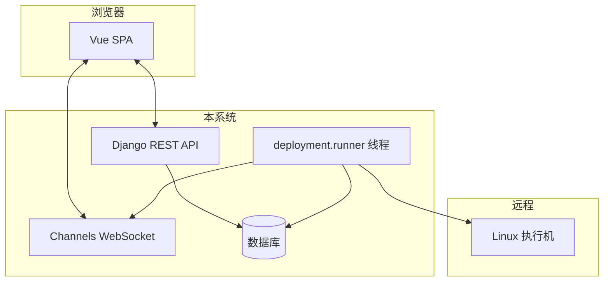

# 第 10 章：Django 工程壳与目录地图

本章用**文件夹视角**总览仓库：每个顶层目录是干什么的、和运行时有什么关系。

---

## 1. 顶层目录速查

| 路径 | 是什么 |
|------|--------|
| `manage.py` | Django 命令行入口（迁移、创建管理员等） |
| `tpops_deployment/` | **项目配置包**：`settings.py`、`urls.py`、`asgi.py`、`wsgi.py`、SPA 视图 |
| `apps/` | **业务应用**，每个子目录通常对应一块功能 |
| `templates/` | Django 模板目录；本项目的 **`index.html`** 给 SPA 用 |
| `static/` | 开发时直接提供的静态文件（JS/CSS/图片） |
| `media/` | 用户上传文件落盘目录（如安装包）；**不要提交敏感大文件到 git** |
| `plan/` | 功能设计文档（给产品/开发对齐用） |
| `docs/` | 开发者文档（含 **`chapters/`** 分章） |
| `requirements.txt` | Python 依赖列表 |

---

## 2. `tpops_deployment/`（工程壳）

| 文件 | 一句话 |
|------|--------|
| `settings.py` | 装哪些应用、数据库、JWT、Channels、静态/媒体路径 |
| `urls.py` | 网站 URL 总表：把 `/api/...` 分给各 app |
| `asgi.py` | **生产推荐入口**：同时处理 HTTP 与 WebSocket |
| `wsgi.py` | 传统仅 HTTP 部署时用 |
| `views.py` | 返回 SPA 的 `index.html`，并做静态资源缓存参数 |

---

## 3. `apps/` 下各应用（与 INSTALLED_APPS 一致）

| 应用 | 职责 |
|------|------|
| `tpops_auth` | 用户、注册登录、JWT |
| `hosts` | SSH 主机、加密凭证、测连、读远程 user_edit |
| `deployment` | 部署任务、runner、user_edit 校验、任务权限 |
| `packages` | 安装包版本与文件上传 |
| `manifest` | manifest YAML 解析与调试 API |
| `logs` | WebSocket 路由与消费者（任务推送、远程 log tail） |

每个应用里常见文件模式：

- **`models.py`**：数据库表  
- **`views.py` 或 `viewsets.py`**：接口  
- **`serializers.py`**：DRF 校验与序列化  
- **`urls.py`**：该应用的子路由（被根 `urls.py` include）  
- **`migrations/`**：数据库结构变更历史（不要手改生成文件）

---

## 4. 运行时数据流（总图）

---

## 5. 读完本章后建议

- 若要**改接口**：从 `urls.py` 找到 ViewSet，再读 `serializers` 与 `models`。  
- 若要**改执行逻辑**：精读 **`apps/deployment/runner.py`**。  
- 若要**改实时推送**：读 **`apps/logs/consumers.py`** 与 runner 里的 `_emit`。

---

上一章：[前端 SPA](09-frontend-spa.md)  
下一章：[安全与运维注意](11-security-and-operations.md)
