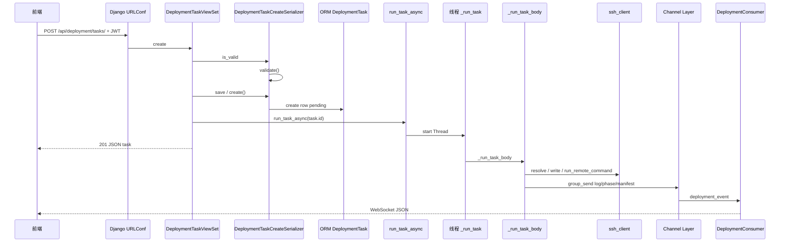
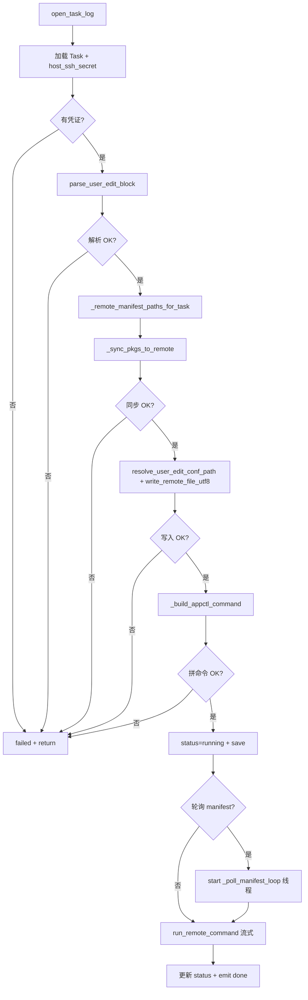

# 部署任务：从接口触发到执行完毕 —— 逐步调用链

本文说明：**用户点击下发后，代码从哪一行入口开始、依次调用哪些函数、在什么线程里跑、何时往 WebSocket 推消息**。阅读时可对照仓库中的源文件。

**相关文件（按阅读顺序）：**

1. `tpops_deployment/urls.py` — 根路由  
2. `apps/deployment/urls.py` — 注册 `DeploymentTaskViewSet`  
3. `apps/deployment/views.py` — `create` 里启动 runner  
4. `apps/deployment/serializers.py` — `DeploymentTaskCreateSerializer.validate` / `create`  
5. `apps/deployment/runner.py` — `run_task_async`、`_run_task`、`_run_task_body` 及子步骤  
6. `apps/hosts/serializers.py` — `host_ssh_secret`  
7. `apps/hosts/ssh_client.py` — SSH/SFTP/远程命令  
8. `apps/logs/consumers.py` — WebSocket 订阅 `deployment_<task_id>` 组  

---

## 1. 前端触发的 HTTP 接口

| 项目 | 值 |
|------|-----|
| **方法** | `POST` |
| **路径** | `/api/deployment/tasks/` |
| **认证** | Header：`Authorization: Bearer <access_token>` |
| **典型 Body（JSON）** | `host`、`deploy_mode`、`user_edit_content`、`action`、`target`（部分必填）、`package_release`、`package_artifact_ids`、`skip_package_sync`，以及三节点时的 `host_node2`、`host_node3` |

**路由如何落到视图：**

1. `tpops_deployment/urls.py`：`path("api/deployment/", include("apps.deployment.urls"))`  
2. `apps/deployment/urls.py`：`DefaultRouter` 注册 `DeploymentTaskViewSet`，basename 为 `deployment-task`，资源前缀为 **`tasks`**，故完整路径为 **`/api/deployment/tasks/`**。  
3. DRF 将 `POST .../tasks/` 派发到 **`DeploymentTaskViewSet.create`**（因 ViewSet 混入了 `CreateModelMixin`，但本类 **重写了 `create` 方法**，见下节）。

---

## 2. 视图层：`DeploymentTaskViewSet.create`（仍在 HTTP 请求线程）

**文件：** `apps/deployment/views.py`

调用顺序：

```
DeploymentTaskViewSet.create(request)
  ├─ self.get_serializer(data=request.data)
  │     └─ get_serializer_class() → action=="create" 时返回 DeploymentTaskCreateSerializer
  ├─ serializer.is_valid(raise_exception=True)
  │     └─ DeploymentTaskCreateSerializer.validate(attrs)   # 见第 3 节
  ├─ 额外检查：host.created_by 与当前用户（与 serializer 内主机权限略有重复，双保险）
  ├─ task = serializer.save()
  │     └─ DeploymentTaskCreateSerializer.create(validated_data)   # 见第 3 节
  ├─ run_task_async(task.id)                                      # 见第 4 节：非阻塞，起新线程
  └─ return Response(DeploymentTaskSerializer(...).data, 201)
```

**要点：**`run_task_async` **立即返回**，HTTP 响应里任务状态通常仍是 **`pending`**；真正执行在 **守护线程** 里进行。

---

## 3. 序列化层：校验与入库

**文件：** `apps/deployment/serializers.py`，类 **`DeploymentTaskCreateSerializer`**

### 3.1 `is_valid()` → `validate(self, attrs)`

在 `serializer.is_valid(raise_exception=True)` 时执行，主要做：

- `action` 是否在允许集合内（`_VALID_ACTIONS`）。  
- `deploy_mode` 单节点/三节点与 `host_node2`/`host_node3` 是否矛盾。  
- `user_edit_content` 非空，且 **`parse_user_edit_block(content)`** 无错误。  
- 各 `host` 的 `created_by` 与当前用户（非 staff）是否冲突。  
- `skip_package_sync` 为真时清空 `package_release` / `package_artifact_ids`。  
- 未跳过时：`package_release` 与 `package_artifact_ids` 一致性、artifact 属于该 release、install/upgrade 下的**文件名角色**与数量（TPOPS 主包至多一个等）。

失败则抛 **`ValidationError`**，HTTP **400**，**不会**创建任务，也 **不会**调用 `run_task_async`。

### 3.2 `serializer.save()` → `create(self, validated_data)`

- 写入 **`created_by`**（当前用户）。  
- 单节点时强制 **`host_node2`/`host_node3` = None`**。  
- 跳过同步时再次清空包字段。  
- **`package_cpu_type` / `package_os_type` 置空字符串**（MVP 不按向导校验 CPU/OS）。  
- **`super().create(validated_data)`** → Django ORM **`DeploymentTask.objects.create(...)`**，数据库中出现一行，默认 **`status=pending`**。

---

## 4. 异步入口：`run_task_async` → 新线程

**文件：** `apps/deployment/runner.py`

```python
def run_task_async(task_id: int):
    thread = threading.Thread(target=_run_task, args=(task_id,), daemon=True)
    thread.start()
```

- **不等待**线程结束；HTTP 线程继续返回 201。  
- **`daemon=True`**：进程退出时线程可被直接结束（部署任务应跑在常驻 Daphne 进程内）。  
- 线程入口：**`_run_task(task_id)`**。

---

## 5. 线程外壳：`_run_task`

**文件：** `apps/deployment/runner.py`

```
_run_task(task_id)
  ├─ close_old_connections()          # 新线程必须用新 DB 连接，避免 SQLite 锁/失效连接
  ├─ try: _run_task_body(task_id)
  ├─ except Exception:
  │     ├─ logger.exception(...)
  │     ├─ 若任务仍为 pending/running → 更新为 failed、写 error_message、exit_code=-1
  │     └─ _emit(... log / status / done)   # 通知前端任务因异常结束
  └─ finally:
        ├─ _flush_log_batch_for_task(task_id)   # 把合并缓冲的日志发完
        ├─ close_task_log(task_id)              # 关闭本地 task_*.log
        └─ close_old_connections()
```

---

## 6. 核心流水线：`_run_task_body`（逐步函数）

以下均在 **`_run_task` 所起的守护线程** 中执行。

### 步骤 A：打开本地文件日志

- **`open_task_log(task_id)`**（`apps/deployment/task_file_log.py`）  
- 若 ORM 查不到任务则 **return**（极少见）。

### 步骤 B：加载任务与 SSH 密钥

- **`DeploymentTask.objects.select_related("host", "host_node2", "host_node3", "package_release").filter(pk=task_id).first()`**  
- **`host_ssh_secret(task.host)`**（`apps/hosts/serializers.py` → `decrypt_secret`）  
- 若无凭证：更新任务为 **failed**，`_emit` 日志后 **return**。

### 步骤 C：解析 user_edit（仅校验块，不入库）

- **`parse_user_edit_block(final_conf)`**（`apps/deployment/user_edit.py`）  
- 若 `parse_err`：任务 **failed**，**return**（注意：创建 API 已校验过；此处防数据被改坏等情况）。

### 步骤 D：计算 manifest 轮询路径（先算好，后面用）

- **`_remote_manifest_paths_for_task(h, task.deploy_mode, kv)`**（`runner.py`）  
- 根据单节点/三节点与 `user_edit` 里的 IP 拼出远程相对路径列表。

### 步骤 E：同步安装包（先于写配置）

- 若未跳过：`_emit` **`phase: package_sync`** 与步骤说明日志。  
- **`ok_pkg, perr = _sync_pkgs_to_remote(task_id, task, secret)`**

**`_sync_pkgs_to_remote` 内部可能走向：**

| 条件 | 调用 |
|------|------|
| `skip_package_sync` | 打日志 + `media_prep_done`，返回 `(True, "")` |
| **`_should_tpops_gaussdb_media_prep(task)`** 为真 | **`_sync_tpops_gaussdb_media`**（/data 解压 TPOPS、docker-service、移 pkgs 等） |
| 否则且 `package_artifact_ids` 为空 | `media_prep_done`，返回成功 |
| 否则 | **`remote_mkdir_p`** → 循环 **`_sftp_put_with_progress`**（内部 **`sftp_put_file`**）到 `<部署根>/pkgs/` |

失败则任务 **failed**，**return**。

### 步骤 F：解析远程 user_edit 路径并写入

- **`resolve_user_edit_conf_path(...)`**（`apps/hosts/ssh_client.py`）  
- 若未找到现成文件：使用 **`_default_user_edit_path(h)`**，**`remote_mkdir_p`** 父目录。  
- 若找到：**`task.save(update_fields=["remote_user_edit_path", ...])`**  
- **`write_remote_file_utf8(..., path, final_conf)`**（`ssh_client.py`）  
- 失败则 **failed**，**return**。  
- 成功后再 **`task.save`** 回填路径，`_emit` 日志。

### 步骤 G：拼 appctl 命令

- **`_build_appctl_command(h, task.action, target, deploy_mode)`**  
- 失败（如 precheck 未填 target）→ **ValueError** 捕获 → 任务 **failed**，**return**。

### 步骤 H：标记运行中并发 WS

- **`task.status = RUNNING`**，`task.started_at = now`，**`task.save`**  
- **`_emit(type="status")`**、**`_emit(type="phase", phase="run_appctl", command=cmd)`**、**`_emit(type="log", 执行: cmd)`**

### 步骤 I：Manifest 轮询（与 appctl 并行，仅 install/upgrade）

- **`_should_poll_manifest(task.action)`** 为假：发 **`precheck_no_manifest`** 等 phase，**不启动** poller。  
- 为真：  
  - **`_emit(phase="manifest_polling", paths=...)`**  
  - 可选 **`_poll_manifest_once`**（首次尝试）  
  - **`threading.Thread(target=_poll_manifest_loop, args=(task_id, host_id, secret, stop_poll, manifest_paths), daemon=True).start()`**  
- **`stop_poll`** 在 appctl 循环 **`finally`** 里 **`set()`**，让轮询线程退出。

**`_poll_manifest_loop`**：循环里 **`_poll_manifest_once`** → 读远程 YAML → **`manifest_to_tree` / `merge_tpops_manifest_dicts`** → **`_emit(type="manifest", data=...)`**（具体见 `runner.py` 内 `_poll_manifest_once` 实现）。

### 步骤 J：流式执行 appctl

- **`for chunk in run_remote_command(hostname, ..., cmd, ...)`**（`ssh_client.py`，生成器逐块 yield）  
- 内层：按行缓冲 **`_flush_log_lines`** → **`_emit(type="log", data=...)`**  
- stdout 中若出现 **`init manifest successful`**（可配置 needle）可再发 phase（与现场脚本有关）。  
- 流里解析 **`__EXIT_CODE__:n`** 得到退出码。

### 步骤 K：收尾

- **`stop_poll.set()`**（停止 manifest 线程）  
- 根据 **`exit_code`** 设 **`success`/`failed`**，写 **`finished_at`**，**`task.save`**  
- **`_emit(status)`**、**`_emit(done, ...)`**  
- 函数正常结束后，**`_run_task` 的 `finally`** 会 **`close_task_log`** 等。

---

## 7. `_emit` 如何把消息送到浏览器？

**文件：** `apps/deployment/runner.py`

- **`_emit(task_id, payload)`**  
  - 对非 `log` 或特殊类型：先 **`_flush_log_batch_for_task`**，再 **`_emit_immediate`**。  
  - 对 **`type=="log"`**：先入批量缓冲，达字符数或时间阈值再 **`_emit_immediate`**（减轻 Channels 压力）。  
- **`_emit_immediate`**：  
  - **`write_task_log`**（若打开过文件日志）  
  - **`get_channel_layer()`** → **`async_to_sync(layer.group_send)("deployment_<task_id>", {"type": "deployment_event", "payload": payload})`**  
- **`DeploymentConsumer.deployment_event`**（`apps/logs/consumers.py`）把 **`payload`** JSON 发给已连接该任务的 WebSocket 客户端。

前端需提前连接：**`ws://.../ws/deploy/<task_id>/?token=<JWT>`**。

---

## 8. 总览时序图（Mermaid）



---

## 9. `_run_task_body` 内部流程图（简化）



---

## 10. 其它相关 API（不走 `run_task_async`）

| 接口 | 作用 |
|------|------|
| `GET /api/deployment/tasks/` | 列表；`filter_deployment_tasks_for_user` |
| `GET /api/deployment/tasks/<id>/` | 详情 |
| `GET /api/deployment/tasks/<id>/manifest_snapshot/` | **同步** SSH 读 manifest；**`fetch_manifest_tree_for_task`** |
| `POST /api/deployment/tasks/<id>/cancel/` | 仅改 DB 状态为 cancelled，**不**向 runner 发信号杀线程 |

---

## 11. 调试建议

1. **断点**：在 `views.create` 的 `run_task_async` 前后、`runner._run_task_body` 开头、`_sync_pkgs_to_remote` 返回处。  
2. **日志**：看服务端控制台 **`logger.exception`**；看 **`logs/deployment_tasks/task_<id>.log`**。  
3. **前端**：Network 看 **201** 与响应体里的 **`id`**；再对 **`ws/deploy/<id>/?token=`** 看帧里 `hello` / `log` / `done`。  
4. **SQLite 锁**：若任务一直 pending，检查是否在多线程中忘记 **`close_old_connections`**（runner 已在关键路径调用）。

---

## 12. 延伸阅读

- 分章总览：[部署模块（第 5 章）](chapters/05-deployment-module.md)  
- 安装包与 runner 细节：`plan/plan-tpops-gaussdb-package-selection.md`  
- 工程导航：`docs/PROJECT_GUIDE.md`

---

*若 `runner.py` 内函数名或顺序有重构，请以源码为准并更新本文档。*
