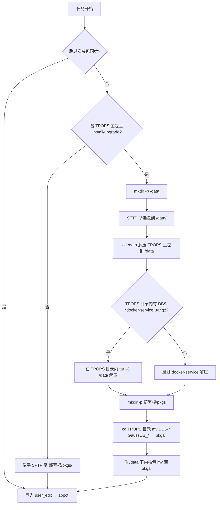

# TPOPS GaussDB 安装介质：选包与远端准备

**状态**：已实现（MVP）  
**关联**：`apps/deployment/runner.py`、`apps/deployment/serializers.py`、`apps/deployment/package_patterns.py`、`static/js/app/deploy.js`、`static/js/app/template.js`、`static/js/app/main.js`

## 目标

1. **部署向导**：将「安装包 / 介质」从「操作与配置」中拆出，**先选节点 → 再选包 → 最后配置与下发**。选包步骤：选版本后按 **TPOPS 主包 / om-agent / OS 内核** 三类分别勾选是否同步并单选文件；未勾选「同步此类」即跳过该类。步骤内提示节点 1 的 `<部署根>/pkgs/` 路径。
2. **介质类型（当前版本）**：与上传命名一致的三类：
   - `TPOPS-GaussDB-Server_{CPU}_*.tar.gz`（安装 / 升级且未跳过时 **可选**；勾选才走 `/data` 解压与汇聚，否则仅扁平同步其它包）
   - `DBS-GaussDB-Kernel_{CPU}_*.tar.gz`（om-agent，可选）
   - `DBS-GaussDB-{OS}-Kernel_{CPU}_*.tar.gz`（内核，可选）
3. **执行机（节点 1）**：runner 中 **先于** `user_edit_file.conf` 写入执行介质步骤（避免解压出的 `docker-service` 覆盖已写配置），再写配置、再 `appctl`。在 `install` / `upgrade`、未跳过同步且**勾选了 TPOPS 主包**时，于远端：`mkdir -p /data` → **全部所选包**先 SFTP 到 `/data/` → `cd /data && tar -xzf TPOPS-*.tar.gz -C /data` → 在 **`TPOPS-GaussDB-Server`**（无后缀，常见）或 **`TPOPS-GaussDB-Server_*`**（旧命名）目录内若存在 `DBS-*docker-service*.tar.gz` 则执行 `tar -xzf <包名> -C /data`（**不因**提前存在 `<部署根>` 而跳过；且 **`mkdir -p <部署根>/pkgs` 放在解压之后**，避免仅因本任务创建了空 `pkgs` 目录而误判）。随后在该 TPOPS 目录内将 `DBS-*`、`GaussDB_*` 移入 `<部署根>/pkgs/` → 将 `/data` 下所选 om/OS 内核包移入 `pkgs/`。**未勾主包**则跳过 `/data` 解压段，仅对已选 artifact 执行扁平 `pkgs/` 同步。其余动作仍使用原有扁平同步。

## 流程图（Mermaid）

## 非目标（MVP）

- 多历史版本兼容策略、节点 2/3 传包。
- 根据「部署根是否已存在」自动跳过 docker-service 解压（易与平台提前 `mkdir pkgs` 冲突，已移除）。

## 数据模型

- `DeploymentTask.package_cpu_type`、`package_os_type`：字段保留；创建任务时不再由向导填写，服务端写空字符串。安装 / 升级时的介质规则仅依赖**文件名模式**（不再与用户所选 CPU/OS 交叉校验）。

## 验收

- 向导可走完；`install`/`upgrade` 未跳过时所选包文件名符合约定；主包可选（有则走 `/data` 流程，无则只同步已选包到 pkgs）。
- 任务执行日志可见 `/data` 与 `pkgs` 准备阶段；`appctl` 行为不变。
